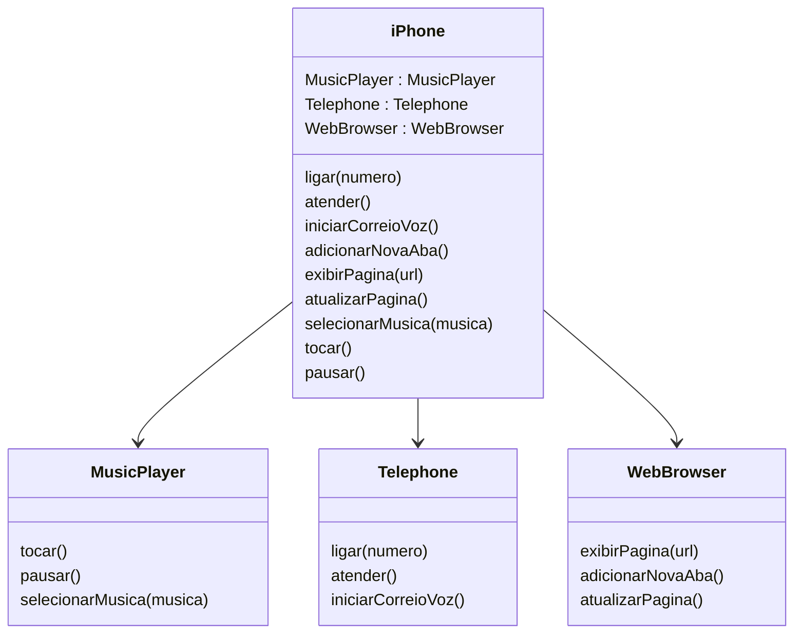

### Diagrama UML (Mermaid)


### Classes e Interfaces correspondentes em Java
```java
public interface ReprodutorMusical {
    void tocar();
    void pausar();
    void selecionarMusica(String musica);
}

public class ReprodutorMusicalImpl implements ReprodutorMusical {
    @Override
    public void tocar() {
        // Implementação para tocar a música
    }

    @Override
    public void pausar() {
        // Implementação para pausar a música
    }

    @Override
    public void selecionarMusica(String musica) {
        // Implementação para selecionar uma música específica
    }
}
```

```java
public interface AparelhoTelefonico {
    void ligar(String numero);
    void atender();
    void iniciarCorreioVoz();
}

public class AparelhoTelefonicoImpl implements AparelhoTelefonico {
    @Override
    public void ligar(String numero) {
        // Implementação para fazer uma ligação para o número especificado
    }

    @Override
    public void atender() {
        // Implementação para atender uma chamada
    }

    @Override
    public void iniciarCorreioVoz() {
        // Implementação para iniciar o correio de voz
    }
}
```

```java
public interface NavegadorInternet {
    void exibirPagina(String url);
    void adicionarNovaAba();
    void atualizarPagina();
}

public class NavegadorInternetImpl implements NavegadorInternet {
    @Override
    public void exibirPagina(String url) {
        // Implementação para exibir uma página web através da URL
    }

    @Override
    public void adicionarNovaAba() {
        // Implementação para adicionar uma nova aba no navegador
    }

    @Override
    public void atualizarPagina() {
        // Implementação para atualizar a página web atual
    }
}
```
```java
public class iPhone {
    MusicPlayer musicPlayer = new ReprodutorMusicalImpl();
    Telephone telephone = new AparelhoTelefonicoImpl();
    WebBrowser webBrowser = new NavegadorInternetImpl();

    public void ligar(String numero) {
        telephone.ligar(numero);
    }

    public void exibirPagina(String url) {
        webBrowser.exibirPagina(url);
    }
}
```
