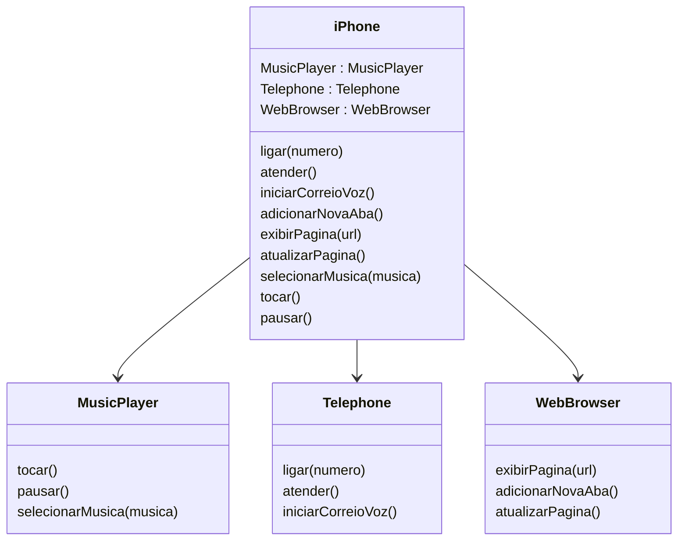

### Diagrama UML (Mermaid)


### Classes e Interfaces correspondentes em Java
```java
public interface MusicPlayer {
    void play();
    void pause();
    void selectMusic(String music);
}

public class MusicPlayerImpl implements MusicPlayer {
    @Override
    public void play() {
        // Implementação para tocar a música
    }

    @Override
    public void pause() {
        // Implementação para pausar a música
    }

    @Override
    public void selectMusic(String music) {
        // Implementação para selecionar uma música específica
    }
}
```

```java
public interface Telephone {
    void call(String number);
    void answer();
    void startVoiceMail();
}

public class TelephoneImpl implements Telephone {
    @Override
    public void call(String number) {
        // Implementação para fazer uma ligação para o número especificado
    }

    @Override
    public void answer() {
        // Implementação para atender uma chamada
    }

    @Override
    public void startVoiceMail() {
        // Implementação para iniciar o correio de voz
    }
}
```

```java
public interface WebBrowser {
    void displayPage(String url);
    void addNewTab();
    void refreshPage();
}

public class WebBrowserImpl implements WebBrowser {
    @Override
    public void displayPage(String url) {
        // Implementação para exibir uma página web através da URL
    }

    @Override
    public void addNewTab() {
        // Implementação para adicionar uma nova aba no navegador
    }

    @Override
    public void refreshPage() {
        // Implementação para atualizar a página web atual
    }
}
```
```java
public class iPhone {
    MusicPlayer musicPlayer = new ReprodutorMusicalImpl();
    Telephone telephone = new AparelhoTelefonicoImpl();
    WebBrowser webBrowser = new NavegadorInternetImpl();

    public void ligar(String numero) {
        telephone.ligar(numero);
    }

    public void exibirPagina(String url) {
        webBrowser.exibirPagina(url);
    }
}
```
